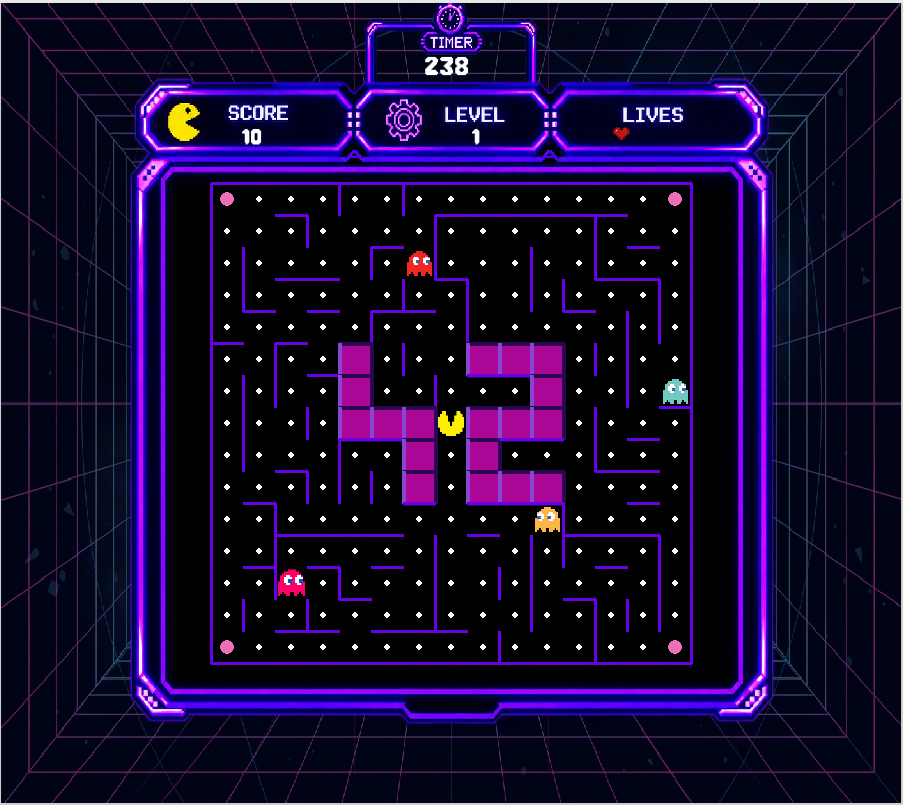

*This activity has been created as part of the 42 curriculum by sshakhat, syasin*
<h1><mark>Description</mark></h1>
<h3>What is pacman game?</h3>
Pac-Man was the first game to popularize the concept of a power-up — the Pacgum (or
Power Pellets) that lets you eat the ghosts. The original arcade machine had 256 levels, but due
to an integer overflow bug, level 256 was impossible to finish, known as the infamous “kill screen”
<h4>Brief overview</h4>



<h3>What is the purpose of pacman game to you as programmer?</h3>
With this activity, you’ll breathe new life into this classic by building your own version — in
Python, with modern structure and project organization, ready to be deployed on a real gaming
platform.
<h2>Pygame</h2>
<h3>What is pygame used for?</h3>
- Pygame is a free, open-source Python library designed for creating 2D video games and multimedia applications.
- pygame helps you draw images.
- can helps to create texts and timers.
<h3>What pygame is good for?</h3>
- 2D Indie Games
- Prototyping
- Learning
<h3>Can pygame helps to create AAA games?</h3>
Pygame is mainly designed for lightweight 2D games and is not suitable for developing modern AAA games on its own.

Although Pygame can benefit from GPU acceleration, it does not provide the advanced 3D rendering pipelines, physics systems, animation systems, and other specialized technologies typically required by AAA games. It is also based on Python, which is generally less suitable than languages such as C++ for the performance-critical parts of large game engines.

Pygame is therefore a great choice for learning game development and creating 2D games, but professional AAA games are typically developed using powerful game engines such as Unreal Engine or Unity.
<h4>Installation</h4>

```bash
pip install pygame
```
<h3>pygame basics Documentaion</h3>

```pygame.init()```:
This will attempt to initialize all the pygame modules for you. Not all pygame modules need to be initialized, but this will automatically initialize the ones that do. You can also easily initialize each pygame module by hand.<br>
```pygame.time.get_ticks()```:
get the time in milliseconds<br>
```pygame.time.Clock```:
create an object to help track time<br>
```pygame.time.delay()```:
pause the program for an amount of time<br>
For alpha transparency, like in .png images, use the ```pygame.Surface.convert_alpha()```change the pixel format of an image including per pixel alphas method after loading so that the image has per pixel transparency.<br>
```pygame.quit()```:
Modules that are initialized also usually have a quit() function that will clean up. There is no need to explicitly call these, as pygame will cleanly quit all the initialized modules when python finishes.<br>
```pygame.quit()``` is opposite to ```pygame.init()```.

```screen.blit(source, position)``` is how you draw one image (a Surface) onto another surface.<br>
"Blit" stands for Block Image Transfer — it's an old graphics term for copying pixel data from one surface to another.<br>
"source" the Surface you want to draw.<br>
"position" the origin point is in the top left.<br>

```pygame.USEREVENT``` in pygame customer events can be defined. Each event needs a unique id.
<br>The ids for the user events have to be between pygame.USEREVENT (24) and pygame.NUMEVENTS (32), So there are 8 possible custom event IDs in that range.
<br>In this case pygame.USEREVENT+1 is the event id for the timer event.<br>
To disable the timer for an event, set the milliseconds argument to 0.

<h2>Game Overview</h2>

<h3><u>Game progression</u></h3>
The game consists of at least 10 levels, with each level having a time limit of N seconds. When the player completes a level, they progress to the next level while keeping their current score and remaining lives. If the time limit is reached, the level ends according to the game rules.
<br><br>
The player can pause and resume the game at any time. The game ends when all levels are completed or when the player loses all their lives. When the game ends, either through victory or game over, the final score is displayed and the player can enter their name to save their score in the highscores list. The player is then returned to the main menu.

<h3><u>Player</u></h3>
• Can move through corridors only (no walls).<br>
• Can move in 4 directions (up, down, left, right) using arrow keys or WASD (depending on
your keyboard).<br>
• Starts with 3 lives.<br>
• Loses a life when touched by a ghost.<br>
• Respawns in the middle of the maze after losing a life.<br>
• Game over when all lives are lost.<br>
• Wins the level when all pacgums are eaten.<br>
• Wins the game when all levels are completed.<br>
• Eating a pacgum increases the score by X points.<br>
• Eating a super-pacgum (power pellet) increases the score by Y points and makes ghosts
edible for a short time.<br>
• Eating an edible ghost increases the score by Z points<br>

<h3><u>Ghosts</u></h3>
Move autonomously through corridors

<h4>Ghosts Mode</h4>

There are three different modes: Chase, Frightened, and Spawn.
- **Chase Mode** (Default state): Ghosts moves autonomously through corridors, The ghosts actively hunt down Pacman.
- **Frightend Mode** (Edible): Triggered when pacman eats a super pacgum, where they run away from the player and become edible.
- **Spawn Mode**: The state a ghost enters after being eaten.

<h3><u>Pacgums and Super-pacgums</u></h3>

• Pacgums are small dots placed in most corridors.<br>
• Super-pacgums (power pellets) are larger dots placed in the 4 corners of the maze.<br>
• Eating a pacgum increases the score by X points.<br>
• Eating a super-pacgum increases the score by Y points and makes ghosts edible for a short
time.<br>

<h3><u>Cheat mode</u></h3>
To cheat means to act dishonestly, break rules, or use trickery to gain an unfair advantage.
there is a multiple features we use in our game:<br>
• Invisible Mode — Press <kbd>I</kbd> to activate or deactivate invisible mode.<br>
• Extra Life — Press <kbd>E</kbd> to gain an additional life when the current number of lives is less than 3.<br>
• Freeze Ghosts — Press <kbd>F</kbd> to freeze all ghosts.<br>
• Skip Level — Press <kbd>L</kbd> to skip the current level.<br>


<h3><u>Highscore</u></h3>

The game stores high scores in a JSON file specified by the `highscore_filename` configuration value. When a game ends, the player's name and final score are added to the existing high scores.

If the highscore file does not exist or contains invalid JSON data, the game creates a new highscore list. If no name is provided, the player is saved as **`unknown`**.

After adding a new score, the list is sorted in descending order by score, and only the **Top 10 scores** are kept. The highscore data is stored in JSON format, making it simple to read, update, and preserve between game sessions.

This approach was chosen because a JSON file provides a lightweight and straightforward way to persist the Top 10 scores without requiring a database or additional external dependencies.

<h2><u>Configuration</u></h2>
The game uses a JSON configuration file to define the main gameplay parameters and level settings. This allows the game configuration to be modified without changing the source code.

The configuration file contains the following parameters:

* **`highscore_filename`** — Specifies the file used to store high scores. The default file is `highscore.json`.
* **`level`** — Defines the 10 available levels, including each level's number, maze height, and maze width.
* **`lives`** — Defines the number of lives the player starts with. The default value is **3**.
* **`pacgum`** — Defines the number of Pac-Gums available in the game configuration. The default value is **42**.
* **`points_per_pacgum`** — Defines the score awarded for eating a Pac-Gum. The default value is **10 points**.
* **`points_per_super_pacgum`** — Defines the score awarded for eating a Super Pac-Gum. The default value is **50 points**.
* **`points_per_ghost`** — Defines the score awarded for eating an edible ghost. The default value is **200 points**.
* **`seed`** — Defines the seed used for maze generation. The default value is **42**.
* **`level_max_time`** — Defines the maximum time allowed for each level. The default value is **90 seconds**.

Each level has its own maze dimensions, allowing the maze size to increase or vary throughout the game.

<h2><u>Maze Generation</u></h2>

The game uses the assigned **A-Maze-ing `mazegenerator` package** to generate the mazes instead of implementing a maze generation algorithm directly in the Pac-Man project. For each level, the game creates a `MazeGenerator` instance using the configured maze dimensions and seed. The generated maze is provided by the package through its `maze` attribute.

A **`MazeAdapter`** is used to connect the external `mazegenerator` package with the rest of the game. The adapter receives the `MazeGenerator` instance and retrieves its generated maze as a two-dimensional list of integer cell values.

The resulting maze list is then passed to **`MazeRender`**, which is responsible only for displaying the maze using Pygame. Each integer cell value represents the walls of a cell using bit flags for the four directions:

* `1` — North wall
* `2` — East wall
* `4` — South wall
* `8` — West wall

`MazeRender` iterates through the maze cells, interprets these wall values, calculates the appropriate cell size and position, and draws the corresponding walls on the game screen.

The overall process can be summarized as:

```text
A-Maze-ing MazeGenerator
          ↓
     MazeAdapter
          ↓
     Maze (2D list)
          ↓
      MazeRender
          ↓
     Pygame Screen
```

This separation keeps maze generation independent from maze rendering and allows the project to use the assigned A-Maze-ing package without modifying or reimplementing its generation algorithm.

<h2><u>General Software Architecture</u></h2>

The project is organized into separate modules, with each module responsible for a specific part of the game. The main entry points are `menu.py` and `pac-man.py`, while the core game components are organized inside the `src` directory.

<h3>Main Components</h3>

* **`menu.py`** — Handles the main menu and navigation to the different game options.
* **`pac-man.py`** — Main entry point used to launch the game.
* **`src/main.py`** — Controls the main game logic and game loop.
* **`src/player.py`** — Handles player movement, controls, lives, and player-related interactions.
* **`src/ghosts.py`** — Manages ghost movement, modes, and interactions with the player.
* **`src/pacgum.py`** — Handles Pac-Gums and Super Pac-Gums, including their placement and scoring.
* **`src/maze_loader.py`** — Handles access to the generated maze data.
* **`src/maze_render.py`** — Converts the maze data into a visual representation using Pygame.
* **`src/hud.py`** — Displays gameplay information such as score, lives, level, and remaining time.
* **`src/gameover.py`** — Handles the Game Over and Victory screens.
* **`src/pause.py`** — Handles the pause menu and its available actions.
* **`src/cheat.py`** — Implements the available Cheat Mode features.
* **`src/highscore.py`** — Handles storing, sorting, and retrieving the Top 10 high scores.
* **`src/config_validator.py`** — Validates the configuration values before they are used by the game.

<h3><u>Module Relationships</u></h3>

The main game logic coordinates the different gameplay modules. The maze is obtained through the maze loader and then passed to the maze renderer for display. The player, ghosts, and Pac-Gums interact with the maze during gameplay, while the HUD displays the current game state.

The highscore module is used when the game ends to store the player's final score. The pause, cheat, Game Over, and HUD modules interact with the main game loop to provide additional gameplay functionality.

The overall structure can be summarized as:

```text
                    pac-man.py
                        │
                        ▼
                    main.py
                        │
        ┌───────────────┼────────────────┐
        │               │                │
        ▼               ▼                ▼
     Player           Ghosts          Pac-Gums
        │               │                │
        └───────────────┼────────────────┘
                        │
                        ▼
                 Maze Loader
                        │
                        ▼
                  Maze Renderer
                        │
                        ▼
                   Pygame Screen

          ┌─────────────┼─────────────┐
          ▼             ▼             ▼
         HUD          Pause        Cheat Mode
          │
          ├── Game Over / Victory
          │
          └── Highscore
```

The project also contains a `Graphics` directory for gameplay sprites and visual assets, while the `main` directory contains menu graphics, backgrounds, fonts, and other interface resources. This separates the game's logic from its visual resources and makes the project easier to maintain.

<h2><u>Implementation</u></h2>

The game is implemented in **Python** using **Pygame** for graphics, user input, event handling, and the game loop. The implementation is divided into multiple modules, with each module responsible for a specific gameplay or system component.

The game starts by loading and validating the configuration from the JSON configuration file. The configured level information, gameplay parameters, scoring values, lives, seed, and time limit are then used to initialize the game.

The **A-Maze-ing `mazegenerator` package** is used to generate the maze for each level. The generated maze is accessed through a `MazeAdapter` and provided as a two-dimensional list of cell values. `MazeRender` interprets the cell values and uses Pygame drawing functions to render the maze on the screen.

The main game loop manages player input, movement, collisions, timers, ghost behavior, Pac-Gum collection, scoring, level progression, and game states. The player and ghosts move through the maze based on the generated wall information. Ghosts support different states, including Chase, Frightened, and Spawn modes.

Pygame events are used to handle keyboard input, pause/resume actions, Cheat Mode controls, and custom game timers. The HUD is updated during gameplay to display the current score, remaining lives, current level, and remaining time.

When a level is completed, the game generates the next configured level while preserving the player's score and remaining lives. The game ends when all levels are completed or the player loses all lives. At the end of the game, the final score can be stored using the highscore system.

The highscore system uses a JSON file for persistent storage. New scores are added to the existing list, sorted in descending order, and limited to the Top 10 scores.

The project also includes input validation and error handling for configuration files and required external packages. Dependencies are managed through `requirements.txt`, `pyproject.toml`, and the provided `mazegenerator` wheel package.

<h2><u>Project Management</u></h2>

The project was managed using a structured workflow to organize tasks, track progress, identify risks, and address blocking points and conflicts throughout development. The team divided responsibilities between members and regularly reviewed the project's progress to ensure that the required features were implemented and tested.

The `project_management` directory contains the documentation used to plan, monitor, and evaluate the project:

* **[Team Organization](project_management/Team%20Organization.md)** — Defines the team's roles and responsibilities.
* **[Project Timeline](project_management/Project%20Timeline.md)** — Tracks the planned development timeline and milestones.
* **[Progress Tracking](project_management/Progress%20Tracking.md)** — Tracks the progress of implemented tasks and features.
* **[Risk Analysis](project_management/Risk%20Analysis.md)** — Identifies potential risks and their mitigation strategies.
* **[Blocking Points and Conflicts](project_management/Blocking%20Points%20and%20Conflicts.md)** — Documents development blockers and conflicts encountered during the project.
* **[Acceptance Test Plan](project_management/Acceptance%20Test%20Plan.md)** — Defines the tests used to verify that the implemented features meet the project requirements.
* **[Project Analysis](project_management/Project%20Analysis.md)** — Provides an overall analysis of the project's development and results.

All project management documentation is available in the **[project_management](project_management/)** directory.


<h1><mark>Instructions</mark></h1>

The project uses a Python virtual environment to manage its dependencies. To set up the project, create the virtual environment and install all required dependencies, including the `mazegenerator` package. Once the installation is complete, the game can be launched using `make run`. For debugging, `make debug` starts the game with Python's built-in debugger. The project can also be checked for code quality using `make lint`, which runs both `flake8` and `mypy`. To remove generated Python cache files and other temporary files, use `make clean`.


### Installation

```bash
make venv
make install
```

### Run the Game

```bash
make run
```

### Debug

```bash
make debug
```

### Lint

```bash
make lint
```

### Clean

```bash
make clean
```

<h1><mark>Resources</mark></h1>

* https://pypi.org/project/relab/
* https://www.pygame.org/docs/
* https://youtu.be/AY9MnQ4x3zk?si=xT8HXHIBtO7c_dO-
* https://www.flaticon.com/icons
* https://mycolor.space/
* https://freepacman.org/
* https://stackoverflow.com/questions/73328115/pacman-ghost-movement

<h3>AI Usage</h3>
AI tools were used to assist with creating the following graphics and visual assets for the game:

* Game logo and title graphics
* Main menu background and visual elements
* Player and ghost sprites
* Game Over and Victory screen graphics
* Other decorative visual elements used throughout the game
